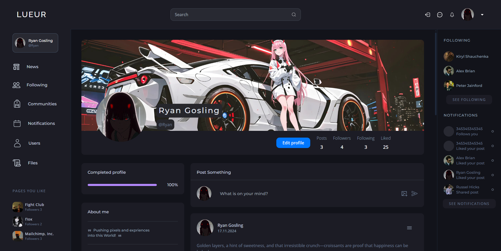
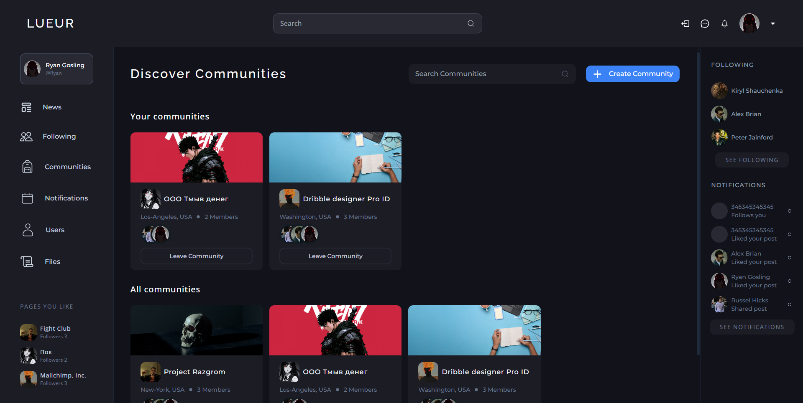
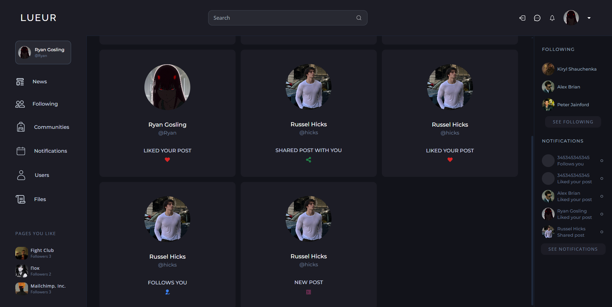

# 🌐 **Platforma Społecznościowa**

> Kompleksowa platforma społecznościowa oparta na Express.js i React. Obsługuje zaawansowane funkcje użytkowników, grup, postów i powiadomień.

---

## 📦 **Funkcje projektu**

### 🔒 **Backend**:
- **Sesje i autoryzacja**: Obsługa JWT i cookie-parser.
- **Baza danych**: MongoDB z Mongoose.
- **REST API**: Ponad 27 tras z metodami **POST**, **GET**, **DELETE** i więcej.
- **Zabezpieczenia**: Middleware uniemożliwiający nieautoryzowany dostęp.
- **Hasła**: Przechowywane w postaci zaszyfrowanej dla większego bezpieczeństwa.

### 🎨 **Frontend**:
- **Routing i nawigacja**: Dynamiczne przekierowania i ochrona dostępu.
- **React-Query**: Efektywne zarządzanie stanem aplikacji i cache'owanie danych.
- **Interfejs użytkownika**: Wygodna obsługa, responsywność i system ładowania.

---

## ⚙️ **Instalacja**

Aby rozpocząć korzystanie z projektu, wykonaj następujące kroki:

1. **Zainstaluj zależności backendu**  
   ```bash
   npm i
   ```
2. **Zainstaluj zależności frontendu**
   ```bash
   cd frontend
   npm i
   ```
3. Zbuduj cały projekt
  ```bash
   npm run build
   ```

### 🚀 **Uruchamianie projektu**:

1. **Uruchomienie backendu**
```bash
   npm run dev
```
2. **Uruchomienie frontendu**
```bash
   cd frontend
   npm run dev
```

### 🛠️ **Funkcjonalności użytkownika**:
🧑‍💻 **Profil użytkownika:**
- Wyświetlanie zdjęcia profilowego, tła, bio, linków i innych informacji.
- Edytowanie danych użytkownika, w tym zmiana zdjęć profilowych.
- Informacje o liczbie postów, subskrypcjach i polubieniach.
  
📝 **Posty:**
- Tworzenie: Posty mogą zawierać tekst, zdjęcia lub oba elementy.
- Interakcje: Możliwość polubienia, komentowania i udostępniania.
- Zarządzanie: Usuwanie postów przez autorów.

🏘️ **Grupy (Communities):**
- Przegląd: Wyświetlanie dostępnych grup i ich administratorów.
- Tworzenie: Możliwość założenia własnej grupy i zarządzania nią.
- Administratorzy: Dodawanie i usuwanie administratorów grup.
  
🔔 **Powiadomienia:**
1) Rodzaje powiadomień:
- Polubienia postów.
- Nowi subskrybenci.
- Udostępnienia postów.
- Nowe posty użytkownika.

2) Oznaczenia: Powiadomienia jako "nieprzeczytane" lub "przeczytane".

---

## 💻 **Technologie użyte w projekcie**

### 🌐 **Backend**
- **Express.js**  
  Framework Node.js zapewniający szybkie i elastyczne tworzenie aplikacji webowych. W projekcie wykorzystany do obsługi tras, middleware i budowy API RESTful.  

- **Routing**  
  Routing został zaimplementowany przy użyciu wbudowanego routera Express.js. Dzięki **middleware** możliwe jest skuteczne zarządzanie trasami i zabezpieczenie endpointów przed nieautoryzowanym dostępem.

- **Cookie-parser**  
  Użyty do obsługi ciasteczek w celu przechowywania danych sesji użytkownika.  

- **JWT Tokens (JSON Web Tokens)**  
  Wykorzystywane do bezpiecznej autoryzacji użytkowników. Tokeny są przechowywane w ciasteczkach i pozwalają na zachowanie aktywności sesji przez określony czas.

- **bcrypt**  
  Użyty do szyfrowania haseł użytkowników przed zapisaniem ich w bazie danych. Zapewnia dodatkową warstwę bezpieczeństwa poprzez implementację funkcji mieszania hasła.  

---

### 🎨 **Frontend**
- **React**  
  Framework do budowy interfejsu użytkownika. W projekcie zastosowany z narzędziem **Vite**, co umożliwia szybsze i bardziej wydajne zarządzanie projektem.

- **TanStack React Query**  
  Służy do zarządzania danymi pochodzącymi z API. Dzięki React Query dane są cache'owane i odświeżane w czasie rzeczywistym, co zwiększa wydajność aplikacji i poprawia wrażenia użytkownika.  

- **Tailwind CSS**  
  Utility-first framework CSS używany do stylizacji aplikacji frontendowej. Umożliwia szybkie tworzenie responsywnych i nowoczesnych interfejsów użytkownika dzięki gotowym klasom.

---

## ⚙️ **Architektura API**
Projekt wykorzystuje architekturę RESTful API z poniższymi założeniami:
- Każdy endpoint jest dobrze udokumentowany i posiada jasno określoną funkcję.
- Obsługiwane metody:
  - **GET**: Pobieranie danych z bazy.
  - **POST**: Tworzenie nowych zasobów (np. użytkownicy, posty).
  - **DELETE**: Usuwanie zasobów (np. postów, grup).
  - **PATCH/PUT**: Aktualizacja istniejących danych.
- Middleware gwarantuje, że tylko zalogowani użytkownicy mogą korzystać z endpointów wymagających autoryzacji.

---

## 🔒 **Bezpieczeństwo**
- **JWT i cookie-parser** są używane w połączeniu, aby zapewnić bezpieczne zarządzanie sesjami.
- Hasła są szyfrowane przy użyciu **bcrypt**, co uniemożliwia ich odczytanie w przypadku wycieku danych.
- Middleware chroni wrażliwe dane, ograniczając dostęp do użytkowników posiadających odpowiednie uprawnienia.

---


### 🗂️ **Struktura bazy danych**
1) **Users**
 - _id (primary key)
 - username
 - fullname
 - password
 - email
 - followers (foreign key)
 - following (foreign key)
 - profileImg
 - coverImg
 - bio
 - link
 - likedPosts(foreign key)
2) **Posts**
 - _id (primary key)
 - likes (foreign key)
 - comments (foreign ket)
 - text
 - user (foreign key)
 - img

3) **Notifications**
 - _id (primary key)
 - read 
 - from (foreign key)
 - to (foreign key)
 - type
 - target (foreign key)

4) **Communities**
 - _id (primary key)
 - location
 - headqurters
 - companySize
 - type
 - industry
 - followers (foreign key)
 - admins (foreign key)
 - coverImg
 - profileImg

### ❗ **Obsługa błędów**
- Wszystkie błędy są obsługiwane zarówno po stronie frontendowej, jak i backendowej.
- Mechanizm blokowania przycisków uniemożliwia wielokrotne wysyłanie zapytań.

  
  
  
  
  
  


[](https://classroom.github.com/online_ide?assignment_repo_id=17521716&assignment_repo_type=AssignmentRepo)
